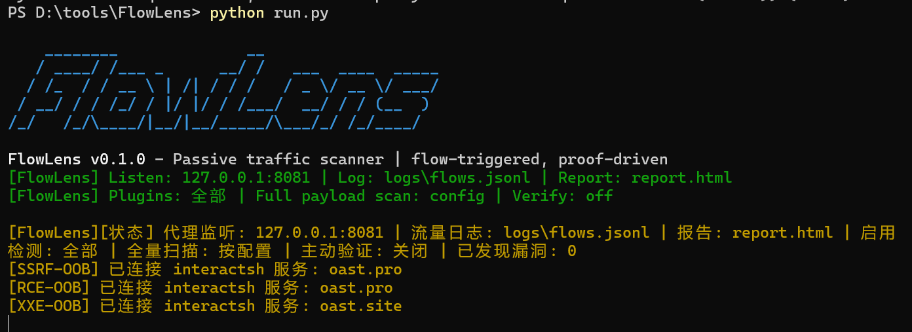

# FlowLens




`FlowLens` 是一个基于 `mitmproxy/mitmdump` 的被动流量安全检测工具。它通过本地代理接收浏览器、BurpSuite 或其他客户端转发的 HTTP/HTTPS 流量，记录请求与响应，并把符合条件的流量提交给插件后台验证，最终输出 JSONL 结果和静态 HTML 报告。

`FlowLens` 在被动传统被动检测基础上新加两个可选 Agent：

- **主动漏洞验证 Agent**：由 `vuln_verify` 提供，运行 `--verify` 后会把已发现漏洞交给 LLM 决策下一步非破坏性验证动作，再由本地受控 HTTP 执行器发包，生成可复现的利用链、payload 和成功请求证据。
- **业务逻辑漏洞 Agent**：由 `agent_pass_scan` 提供，运行 `--logic` 或 `--only-logic` 后会持续索引被动流量，按认证指纹、接口、资源和历史响应建立上下文，对未授权、越权、租户隔离、流程绕过、敏感字段篡改等候选做差分验证，并交给 LLM 输出逻辑漏洞结论。

> 仅在已授权的资产、靶场或测试环境中使用。本工具会重放请求并注入 payload，部分插件会发起带外探测、上传 canary 文件或写入对象存储 canary 对象。

## 功能特性

- 被动接入 HTTP/HTTPS 流量，自动记录请求、响应和耗时。
- 插件化检测 SQL 注入、XSS、命令注入、任意文件读取、SSRF、XXE、SSTI、开放重定向、敏感信息泄漏、对象存储、文件上传、JWT 风险和指纹识别。
- 每个插件拥有独立队列、worker、去重和限速控制。
- 支持 WAF 冷却、静态资源过滤、浏览器后台流量忽略和全量 payload 扫描模式。
- 默认生成 `logs/*.jsonl` 结构化结果和 `report.html` 静态报告。
- 可选启用 `LLM Agent` 做主动漏洞验证和业务逻辑漏洞检测。

## 检测能力

当前已内置以下检测能力：

| 能力 | 命令行开关 | 说明 |
| --- | --- | --- |
| SQL 注入 | `--sqli` | 报错、布尔、inline、UNION、stacked、时间盲注，支持 tamper |
| XSS | `--xss` | 反射/存储统一检测，支持 marker 回扫 |
| 命令注入 / RCE | `--rce` | 命令回显、时间盲注、OOB 带外确认 |
| LFI / 任意文件读取 | `--lfi` | 目录遍历、任意文件读取、`php://filter` 源码读取 |
| SSRF | `--ssrf` | 多协议和绕过变体，基于 OOB 回连确认 |
| XXE | `--xxe` | 带内文件读取、OOB 外部实体解析 |
| SSTI | `--ssti` | 算术回显、字符串转换、模板错误指纹 |
| 开放重定向 / CRLF | `--redir` | 开放重定向、响应头注入 |
| 敏感信息泄漏 | `--sensitive` | AK/SK、API key、Token、私钥、配置文件、Swagger、Actuator 等 |
| OSS / 对象存储 | `--oss` | 桶发现、匿名列举、匿名上传/覆盖、AK/SK 泄漏 |
| 文件上传 | `--upload` | 上传点识别、危险扩展、双扩展、图片马、解析绕过、`.htaccess` 链 |
| JWT | `--jwt` | `alg=none`、签名绕过、弱 HMAC 密钥、claim 风险 |
| 指纹识别 | `--fp` | 框架、中间件、CMS、开源应用等 6646 条指纹 |
| 逻辑漏洞 Agent | `--logic` / `--only-logic` | 基于被动流量索引、语义判断和差分验证检测未授权、越权、租户隔离、流程绕过等 |
| 主动验证 Agent | `--verify` | 对已发现漏洞做 LLM 辅助验证，生成非破坏性利用链和请求证据 |


## 关键模块：

| 路径 | 职责 |
| --- | --- |
| `run.py` | 命令行入口，定位 `mitmdump`，设置环境变量并启动代理 |
| `pass_scan/mitm_addon.py` | mitmproxy addon，记录流量并提交扫描 |
| `pass_scan/scanner.py` | 插件加载、调度、observe/interested/check 入口 |
| `pass_scan/scan_context.py` | 标准化请求响应，提取 query/form/json/cookie/header 参数 |
| `pass_scan/scan_queue.py` | 每插件独立队列、worker、状态输出和 host 限速 |
| `pass_scan/dedup.py` | TTL 去重 |
| `pass_scan/runtime.py` | WAF 冷却状态和运行期辅助逻辑 |
| `pass_scan/reporter.py` | JSONL 写入和 HTML 报告生成 |
| `agent_pass_scan/` | 业务逻辑漏洞 Agent |
| `vuln_verify/` | 主动漏洞验证 Agent |
| `tools/` | 辅助脚本和 interactsh 客户端 |

更多实现细节见各插件目录下 `TECHNICAL_DOC.md`。

## 环境要求

- Python 3.10+

```bash
python3 -m pip install -r requirements.txt
```

- 普通扫描不依赖 LLM 配置。只有启用 `--logic/--only-logic` 或 `--verify` 时才需要配置模型服务。
- 配置 LLM API 在 `.env` 中修改，兼容多种认证协议。


## 快速开始

启动默认扫描代理：

```bash
python3 run.py
```
默认监听地址为 `127.0.0.1:8081`，流量日志写入 `logs/flows.jsonl`，漏洞报告写入 `report.html`。

检测 HTTPS 站点时，需要安装 mitmproxy CA 证书。代理启动后访问 `http://mitm.it`，按系统或浏览器提示安装证书。

## 常用命令

只做 SQL 注入、XSS 和命令注入检测：

```bash
python3 run.py --sqli --xss --rce
```

额外启用业务逻辑漏洞 Agent：

```bash
python3 run.py --logic
```

启用 LLM 主动漏洞验证：

```bash
python3 run.py --verify
```

默认会忽略目标站自签名或无效 TLS 证书，避免 mitmproxy 对自签名目标返回 502。如需强制校验目标站证书：

```bash
python3 run.py --verify-upstream-cert
```

## 命令行参数

| 参数 | 默认值 | 说明 |
| --- | --- | --- |
| `--host` | `127.0.0.1` | 代理监听地址 |
| `--port` | `8081` | 代理监听端口 |
| `--log-file` | `logs/flows.jsonl` | 捕获流量 JSONL 输出路径 |
| `--report-file` | `report.html` | HTML 报告输出路径 |
| `--full-payload-scan` | 关闭 | 启用更完整 payload/tamper，并纳入更多 Cookie/Header 检测 |
| `--verify-upstream-cert` | 关闭 | 校验目标站 TLS 证书 |
| `--sqli` | 关闭 | 只启用 SQL 注入检测 |
| `--fp` | 关闭 | 只启用指纹识别 |
| `--xss` | 关闭 | 只启用 XSS 检测 |
| `--rce` | 关闭 | 只启用命令注入检测 |
| `--lfi` | 关闭 | 只启用目录遍历/任意文件读取检测 |
| `--ssrf` | 关闭 | 只启用 SSRF 检测 |
| `--xxe` | 关闭 | 只启用 XXE 检测 |
| `--ssti` | 关闭 | 只启用 SSTI 检测 |
| `--redir` | 关闭 | 只启用开放重定向/CRLF 检测 |
| `--sensitive` | 关闭 | 只启用敏感信息泄漏检测 |
| `--oss` | 关闭 | 只启用对象存储检测 |
| `--upload` | 关闭 | 只启用文件上传检测 |
| `--jwt` | 关闭 | 只启用 JWT 检测 |
| `--logic` | 关闭 | 在常规插件基础上额外启用业务逻辑漏洞 Agent |
| `--only-logic` | 关闭 | 只启用业务逻辑漏洞 Agent |
| `--verify` | 关闭 | 启用主动漏洞验证 Agent |

## 配置

全局配置位于 `config.yaml`，不存在时会使用 `pass_scan/config.py` 中的默认配置。

| 配置区域 | 说明 |
| --- | --- |
| `scan` | 调度模式、worker、队列、去重、限速、WAF 冷却、全量扫描和忽略 host |
| `report` | 默认 HTML 报告路径 |
| `verification` | 主动漏洞验证 Agent 配置 |
| `plugins` | 各检测插件的启用状态和插件级参数 |

常用配置项：

| 配置项 | 说明 |
| --- | --- |
| `scan.worker_count` | 每个插件默认 worker 数 |
| `scan.queue_size` | 每个插件默认队列长度 |
| `scan.dedup_ttl_seconds` | 同一扫描点去重时间 |
| `scan.per_host_interval_seconds` | 同一 host 主动任务间隔 |
| `scan.max_params_per_request` | 单条请求最多提取的参数数量 |
| `scan.full_payload_scan` | 启用完整 payload 与 Cookie/Header 注入点 |
| `scan.ignored_hosts` | 忽略浏览器、系统后台流量 |
| `scan.waf_backoff_seconds` | 确认 WAF 封禁后的冷却时间 |
| `plugins.<name>.enabled` | 控制插件默认是否启用 |


## 项目结构

```text
.
├── run.py                         # 启动入口，负责拉起 mitmdump
├── config.yaml                    # 全局配置与插件配置
├── requirements.txt               # 运行依赖
├── README.md                      # 项目说明
├── pass_scan/
│   ├── mitm_addon.py              # mitmproxy addon
│   ├── scanner.py                 # 插件加载与调度
│   ├── scan_context.py            # 请求响应标准化和参数提取
│   ├── scan_queue.py              # 插件队列、worker、限速
│   ├── reporter.py                # JSONL 写入和 HTML 报告生成
│   ├── config.py                  # 配置加载和默认配置
│   ├── runtime.py                 # 运行期状态
│   ├── filters.py                 # host 忽略规则
│   ├── sql_injection/             # SQL 注入插件
│   ├── xss/                       # XSS 插件
│   ├── command_injection/         # 命令注入插件
│   ├── path_traversal/            # LFI / 文件读取插件
│   ├── ssrf/                      # SSRF 插件
│   ├── xxe/                       # XXE 插件
│   ├── ssti/                      # SSTI 插件
│   ├── redir/                     # 重定向 / CRLF 插件
│   ├── sensitive_info/            # 敏感信息插件
│   ├── object_storage/            # OSS / 对象存储插件
│   ├── file_upload/               # 文件上传插件
│   ├── jwt/                       # JWT 插件
│   └── fingerprint/               # 指纹识别插件
├── agent_pass_scan/               # 业务逻辑漏洞 Agent
├── vuln_verify/                   # LLM 主动漏洞验证 Agent
├── tools/                         # 辅助工具
├── logs/                          # 运行日志与结果文件
└── report.html                    # 默认报告文件
```

## 安全边界

- 只在授权范围内使用。
- 控制 `scan.worker_count`、`scan.queue_size` 和 `--full-payload-scan`，避免对目标造成过高压力。
- 文件上传和对象存储检测可能产生测试文件或 canary 对象，请确认授权和清理策略。
- 主动验证 Agent 会尝试阻断明显破坏性 SQL、命令和危险方法，但业务副作用仍需由测试环境和授权边界兜底。
- 业务逻辑漏洞 Agent 的 `active_verification_methods` 默认包含 `POST`、`PUT`、`PATCH`、`DELETE`，启用前应确认目标环境允许这类差分重放。
- 代理模式下，主动探测请求默认不走系统代理，避免扫描流量再次绕回本地代理形成回环。

## 运行及输出截图
